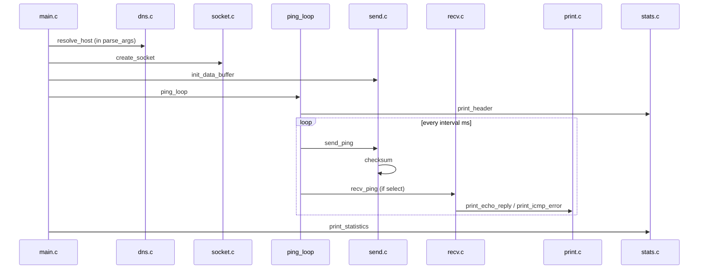

# `ft_ping` architecture (detailed)

`ft_ping` is a from-scratch implementation of the `ping` command in C. It checks whether a host is reachable and measures round-trip time. Output format matches **inetutils-2.0** (reference `ping -V` on Debian).

Below is a plain-language overview of how the program works. The rest of this document covers protocols, data structures, modules, and flags in detail.

---

## Overview

You run the program with a destination (IP address or hostname). Once per second (or faster in flood mode) it sends an ICMP Echo Request and waits for an ICMP Echo Reply. For each reply it prints a line with packet size, sequence number, TTL, and time in milliseconds. On exit it prints a summary: packets sent/received, loss, min/avg/max/stddev.

### Step by step

1. **Startup.** Command-line arguments (host, `-c`, `-v`, `-f`, etc.) are parsed into `t_ping` — the single session state object (socket, address, counters, options).

2. **Root privileges.** A raw socket (`SOCK_RAW` + `IPPROTO_ICMP`) is required, so the program must start as root. The socket is opened as root, then privileges are dropped with `setuid` so the ping loop does not run as superuser.

3. **DNS.** The hostname is resolved to IPv4 via `getaddrinfo` (IPv4 only).

4. **Socket.** A raw ICMP socket is created; TTL, TOS, optional `-r` (no routing), and IP timestamp options are applied.

5. **Main loop.** This is the core of the program:
   - print header `PING host (ip): N data bytes`;
   - send the first packet (plus `-l` preload packets with no delay, if set);
   - run a `select` loop: wait for incoming packets (~10 ms), handle replies, and send the next probe on the `interval` timer (default 1 s, 10 ms with `-f`);
   - stop on Ctrl+C (`SIGINT`), `-c` (N unique replies received), `-w` (wall-clock limit), or after `-c` plus `-W` seconds waiting for late replies.

6. **Send.** Build an ICMP packet: type ECHO, id = low 16 bits of PID, incrementing `seq`, `gettimeofday` at the start of the payload for RTT, then data (56 bytes by default). Compute checksum, send with `sendto`.

7. **Receive.** `recvmsg` reads a buffer containing the IP header and ICMP. If it is an Echo Reply with our `ident`, print a line, update statistics, mark duplicates by `seq`. Other ICMP messages (errors) are printed when `-v` is set.

8. **Shutdown.** Print the statistics block, close the socket, free memory. Exit code 0 if at least one reply was received, otherwise 1.

### Source files

- `main.c` — init, argument parsing, main loop
- `dns.c` — host resolution
- `socket.c` — socket creation and options
- `send.c` / `recv.c` — ICMP send and receive
- `print.c` / `stats.c` — reply lines and final statistics
- `checksum.c` — ICMP checksum
- `signal.c` — Ctrl+C handling

### Notable behavior

- RTT is computed from the timestamp embedded in the payload (send time vs receive time), not from a timer around `sendto`/`recvmsg`.
- `-c` counts **unique** replies; duplicate `seq` values are labeled `(DUP!)` but do not count toward the limit.
- One host per run, IPv4 only.

---

## Table of contents

1. [Overview](#overview)
2. [Constraints and requirements](#constraints-and-requirements)
3. [File layout](#file-layout)
4. [Protocol: what travels on the wire](#protocol-what-travels-on-the-wire)
5. [`t_ping` structure and constants](#t_ping-structure-and-constants)
6. [Full `main()` startup order](#full-main-startup-order)
7. [Modules by file](#modules-by-file)
8. [Main loop: state machine](#main-loop-state-machine)
9. [Sending: building an ICMP packet](#sending-building-an-icmp-packet)
10. [Receiving: parsing IP and ICMP](#receiving-parsing-ip-and-icmp)
11. [Output: replies, errors, IP options](#output-replies-errors-ip-options)
12. [Statistics and RTT math](#statistics-and-rtt-math)
13. [All command-line flags](#all-command-line-flags)
14. [Interaction diagrams](#interaction-diagrams)
15. [Cross-platform notes](#cross-platform-notes)
16. [Build](#build)

---

## Constraints and requirements

| Constraint | Effect in code |
|------------|----------------|
| Raw socket `SOCK_RAW` + `IPPROTO_ICMP` | Must run as root (`sudo`) |
| Specification | Single host; no reverse DNS in replies; inetutils-style output |
| Unreliable network | Loss, duplicates, reorder; IP options often filtered |
| `-Wall -Wextra -Werror` | Strict compile with no warnings |

**Why raw, not a normal socket:** the program assembles the ICMP header itself (type, code, id, seq, checksum, data). The kernel adds the IP header on send. On receive, the raw socket delivers the **full IP packet** — the program sees both IP and ICMP.

**Why `setuid` after `socket`:** the socket is already open with root privileges; the process then drops the effective UID to the real user so it does not run with extra privileges during the ping loop.

---

## File layout

```
ft_ping/
├── includes/
│   └── ft_ping.h      # types, constants, ICMP macros, prototypes
├── srcs/
│   ├── main.c         # main, parse_args, ping_loop, stop conditions
│   ├── dns.c          # resolve_host — IPv4 getaddrinfo
│   ├── socket.c       # create_socket, set_sock_options, set_ip_timestamp
│   ├── send.c         # init_data_buffer, send_ping
│   ├── recv.c         # recv_ping — recvmsg and dispatch
│   ├── print.c        # print_echo_reply, print_icmp_error, IP options
│   ├── stats.c        # print_header, print_statistics
│   ├── checksum.c     # checksum — RFC 1071 (see docs/rfc/rfc1071.txt)
│   ├── signal.c       # setup_signals — SIGINT → g_stop
│   └── utils.c        # parse_number, decode_pattern, calc_stddev
├── Makefile
└── docs/
    ├── rfc/           # RFC 791, 792, 1071, 1122 — standards reference
```

Dependencies between `.c` files are flat: every file includes only `ft_ping.h`. Modules communicate through the shared `t_ping` object and the global `g_stop` flag.

---

## Protocol: what travels on the wire

### Outgoing packet (Echo Request)

The program passes **only the ICMP message** to `sendto()`. The kernel wraps it in an IPv4 header ([RFC 791](rfc/rfc791.txt)):

```
┌──────────────────────────────────────────────────────────────┐
│  IP header (kernel)                                          │
│  src = local IP, dst = target, TTL = --ttl, TOS = -T        │
│  optional: IP Timestamp (--ip-timestamp)                     │
├──────────────────────────────────────────────────────────────┤
│  ICMP Echo Request (8-byte header + payload)                 │
│  ┌────────┬──────┬─────────┬─────────┬──────────┬─────────┐ │
│  │ type=8 │code=0│ checksum│ id (PID)│ sequence │  data   │ │
│  └────────┴──────┴─────────┴─────────┴──────────┴─────────┘ │
│                              ↑                    ↑          │
│                         ping->ident           ping->seq      │
│                              first sizeof(timeval) bytes     │
│                              data = gettimeofday()           │
└──────────────────────────────────────────────────────────────┘
```

| ICMP field | Value in `ft_ping` |
|------------|-------------------|
| type | `ICMP_ECHO` (8) |
| code | 0 |
| id | `getpid() & 0xFFFF` — distinguishes this session from others |
| sequence | incremented after each successful send |
| checksum | [RFC 1071](rfc/rfc1071.txt) over the whole ICMP message |
| data | `struct timeval` + template from `data_buffer` |

The `64 bytes from ...` line in a reply refers to **ICMP + data** (8 + 56 by default), not the full IP packet.

### Incoming Echo Reply

The remote host (or localhost) responds with type **0** (`ICMP_ECHOREPLY`) with the same `id` and `seq`. The payload contains the same timestamp used to compute RTT.

### Incoming ICMP error message

If a packet cannot be delivered (TTL expired, network unreachable, etc.), an **intermediate router or host** sends an ICMP error. Structure:

```
┌────────────────────────────────────────┐
│  IP header (outer)                     │
├────────────────────────────────────────┤
│  ICMP error (type 3, 11, …)            │
│  ┌──────┬──────┬─────────┬────────────┐│
│  │ type │ code │ checksum│  unused    ││
│  └──────┴──────┴─────────┴────────────┘│
│  ┌────────────────────────────────────┐│
│  │ "Quoted" — copy of IP + start ICMP ││  ← our original probe
│  │  inner IP.dst must match target    ││
│  └────────────────────────────────────┘│
└────────────────────────────────────────┘
```

Without `-v`, `print_icmp_error()` shows an error **only if** `inner_ip->ip_dst` matches the current target — unrelated ICMP errors from the network are filtered out.

---

## `t_ping` structure and constants

### `t_ping` — single session state

```c
typedef struct s_ping {
    int                 sockfd;           // raw ICMP socket

    struct sockaddr_in  dest_addr;        // destination IPv4
    char               *hostname;         // CLI argument (google.com)
    char                ip_str[INET_ADDRSTRLEN];  // "142.250.185.46"

    size_t              num_xmit;         // sendto counter
    size_t              num_recv;         // all received Echo Replies
    size_t              num_rept;         // duplicates among them
    unsigned char       recv_table[PING_CKTAB_SZ];  // 128 bytes = 1024 seq

    uint16_t            ident;            // ICMP identifier
    uint16_t            seq;              // next sequence number

    unsigned int        options;          // OPT_* bit flags (-v, -f, --ip-timestamp); see FLAGS.md § Session flags
    size_t              data_length;      // payload size (excluding 8-byte ICMP hdr)
    int                 ttl;              // IP TTL
    int                 tos;              // IP TOS (-1 = unset)
    size_t              count;            // -c (0 = unlimited)
    long                interval;         // microseconds between sends
    int                 timeout;          // -w, seconds (-1 = none)
    int                 linger;           // -W, wait after last send
    unsigned long       preload;          // -l

    unsigned char       pattern[MAXPATTERN];  // up to 16 bytes for -p
    int                 pattern_len;
    bool                pattern_set;

    unsigned int        ip_ts_type;       // SOPT_TSONLY / SOPT_TSADDR
    unsigned char      *data_buffer;      // payload template

    struct timeval      start_time;       // for -w
    t_ping_stat         stats;            // min, max, sum, sumsq RTT
} t_ping;
```

### Important constants (`ft_ping.h`)

| Constant | Value | Meaning |
|----------|-------|---------|
| `PING_PKT_DATA_SZ` | 56 | default payload size |
| `PING_PKT_HDR_SZ` | 8 | ICMP header size |
| `RECV_BUFSIZE` | 65536 | receive buffer |
| `PING_DEFAULT_TTL` | 64 | default TTL |
| `PING_DEFAULT_INTERVAL` | 1 000 000 | 1 second between packets (µs) |
| `PING_FLOOD_INTERVAL` | 10 000 | 10 ms in `-f` mode |
| `PING_CKTAB_SZ` | 128 | seq bit table (1024 numbers) |
| `MAXPATTERN` | 16 | max hex pattern length for `-p` |
| `OPT_VERBOSE` | `1 << 0` (1) | `-v`: verbose header and ICMP error dumps |
| `OPT_FLOOD` | `1 << 1` (2) | `-f`: flood mode |
| `OPT_IPTIMESTAMP` | `1 << 4` (16) | `--ip-timestamp`: attach IP timestamp option |

Only `-v`, `-f`, and `--ip-timestamp` set `ping->options` (via `|=` in `handle_option()`). All other flags use dedicated fields — bitmask layout, combined values, and terminal examples are in **`docs/FLAGS.md`** (section *Session flags: `ping->options` bitmask*).

### Global variables

| Name | Type | Role |
|------|------|------|
| `g_stop` | `volatile sig_atomic_t` | set to 1 on Ctrl+C |
| `g_dontroute` | `int` | 1 when `-r` is passed (outside `t_ping`, read in `socket.c`) |

`volatile sig_atomic_t` for `g_stop` allows safe writes from the signal handler without races with the main loop.

---

## Full `main()` startup order

```
main(argc, argv)
│
├─ init_ping(&ping)              // default values
├─ parse_args(&ping, ...)        // getopt_long + resolve_host — see GETOPT-LONG.md
│     └─ on -? → print_usage, exit(0)  WITHOUT root
│
├─ if (getuid() != 0) → error "Operation not permitted"
├─ create_socket(&ping)          // SOCK_RAW + setsockopt
├─ if (OPT_IPTIMESTAMP) set_ip_timestamp(&ping)
├─ setuid(getuid())              // drop root after socket is open
├─ setvbuf(stdout, _IOLBF)       // line-buffered stdout
├─ setup_signals()               // SIGINT → g_stop = 1
├─ init_data_buffer(&ping)       // malloc payload template
├─ ping_loop(&ping)              // main work
├─ print_statistics(&ping)       // summary on any exit path
├─ cleanup(&ping)                // close, free hostname, free data_buffer
└─ return (num_recv == 0) ? FAILURE : SUCCESS
```

Order matters: **args and DNS before root**, **socket before setuid**, **signals before loop**, **statistics after loop** (including on Ctrl+C).

---

## Modules by file

### `main.c`

| Function | Purpose |
|----------|---------|
| `init_ping` | Zero `t_ping`, set defaults (56 bytes, TTL 64, 1 s interval, ident from PID) |
| `print_usage` | Help text for `-?` |
| `handle_option` | Map one short/long option into `t_ping` fields |
| `parse_args` | `getopt_long`, single host, calls `resolve_host` — [GETOPT-LONG.md](GETOPT-LONG.md) |
| `timeout_reached` | Check `-w`: N seconds elapsed since `start_time` |
| `ping_loop` | Preload, first packet, select/send/recv loop |
| `cleanup` | Close socket, free memory |
| `main` | Orchestrates everything above |

### `dns.c`

| Function | Purpose |
|----------|---------|
| `resolve_host` | `getaddrinfo(host, AF_INET)` → `dest_addr`, `ip_str`, `strdup(hostname)` |

`getaddrinfo` hints: `ai_family = AF_INET`, `ai_socktype = SOCK_RAW`, `ai_protocol = IPPROTO_ICMP`. Reverse DNS is **never** called on receive.

### `socket.c`

| Function | Purpose |
|----------|---------|
| `set_sock_options` | `SO_BROADCAST`, `IP_TTL`, `IP_TOS`, `SO_DONTROUTE`, `SO_RCVTIMEO` |
| `set_ip_timestamp` | `IP_OPTIONS` — timestamp option on outgoing IP packets |
| `create_socket` | `socket()` + `set_sock_options` |

### `send.c`

| Function | Purpose |
|----------|---------|
| `init_data_buffer` | `malloc(data_length)`, fill with pattern or 00 01 02 … |
| `send_ping` | Build ICMP, checksum, `sendto`, `num_xmit++`, `seq++` |

### `recv.c`

| Function | Purpose |
|----------|---------|
| `recv_ping` | `recvmsg`, parse IP/ICMP, call `print_echo_reply` or `print_icmp_error` |

Filtering: Echo Reply only when `id == ping->ident`; foreign ICMP Echo Requests are ignored; other ICMP types → errors.

### `print.c`

| Function | Purpose |
|----------|---------|
| `print_echo_reply` | RTT, duplicates, reply line, IP options |
| `print_icmp_error` | Error text + optional verbose dump |
| `print_ip_opt` | Parse TS, RR, NOP, unknown in reply IP header |
| `print_ip_header_dump` | Hex IP dump (only with `-v`) |
| `print_inner_protocol` | TCP/UDP/ICMP inside quoted packet |

### `stats.c`

| Function | Purpose |
|----------|---------|
| `print_header` | `PING host (ip): N data bytes` [, id with `-v`] |
| `print_statistics` | `--- host ping statistics ---` block |

### `checksum.c`

| Function | Purpose |
|----------|---------|
| `checksum` | 16-bit one's complement sum per [RFC 1071](rfc/rfc1071.txt) |

### `signal.c`

| Function | Purpose |
|----------|---------|
| `setup_signals` | `sigaction(SIGINT)` → `g_stop = 1` |
| `sig_int_handler` | Minimal handler with no unsafe calls |

### `utils.c`

| Function | Purpose |
|----------|---------|
| `parse_number` | `strtol` with range checks for `-c`, `-s`, `--ttl`, etc. — [OPTARG.md](OPTARG.md) |
| `decode_pattern` | Hex parse for `-p` (odd digit count → low nibble 0) |
| `calc_stddev` | `sqrt(tsumsq/n - (tsum/n)²)` |

---

## Main loop: state machine

`ping_loop()` is the heart of the program. Single-threaded: no separate send/receive threads.

### Phase 0: startup

1. `gettimeofday(&ping->start_time)` — start clock for `-w`.
2. `print_header(ping)`.
3. Loop `preload` times: `send_ping` with no delay (`-l`).
4. One more `send_ping` — first "normal" packet.
5. Record `last_send` for the interval timer.

### Phase 1: main loop (`while (!g_stop)`)

Each iteration:

```
┌─────────────────────────────────────────────────────────┐
│ 1. timeout_reached?  → break (-w flag)                  │
│ 2. select(sockfd, timeout=10ms)                         │
│    ├─ EINTR → continue (signal interrupted select)      │
│    ├─ readable → recv_ping()                            │
│    │     └─ if -c and unique replies >= count → break   │
│ 3. elapsed = now - last_send                            │
│    if elapsed >= interval:                              │
│    ├─ if still sending (no -c or xmit < count):         │
│    │     send_ping(); update last_send                  │
│    │     flood: putchar('.')                            │
│    ├─ else if already finishing → break                 │
│    └─ else: finishing=1, interval = linger * 1e6      │
│              (wait for late replies after -c)           │
└─────────────────────────────────────────────────────────┘
```

### Why both `select(10ms)` and `SO_RCVTIMEO(1s)`

- `select` with 10 ms lets the loop wake regularly to **send the next packet** on the `interval` timer without blocking on receive for too long.
- `SO_RCVTIMEO` is a socket-level fallback timeout for `recvmsg`.

### `-c` (count): two counters

| Counter | What it counts |
|---------|----------------|
| `num_xmit` | Number of successful `sendto` calls |
| `num_recv` | All Echo Replies (including duplicates) |
| `num_rept` | Duplicates only |

Stop condition for `-c`: `(num_recv - num_rept) >= count` — requires **N unique** replies. A duplicate increments `num_recv` but does not count toward the limit.

After `count` packets have been sent, the loop enters **finishing**: `interval` switches to `linger` seconds (default 10, flag `-W`) to wait for replies to the last probes.

### `-f` (flood)

- `interval = 10 000` µs (10 ms).
- On send, prints `.`; on reply, `print_echo_reply` prints `\b` (erases the dot). Same visual feedback as classic `ping -f`.

### `-w` (wall-clock timeout)

`timeout_reached` compares **seconds only** (`tv_sec`), ignoring microseconds — matches inetutils behavior for this flag.

---

## Sending: building an ICMP packet

Step by step in `send_ping()`:

1. **Size:** `pkt_sz = 8 + data_length`.
2. **ICMP header:** type 8, code 0, id and seq in **network byte order** (`htons`).
3. **Timestamp in payload:** if `data_length >= sizeof(timeval)`, write `gettimeofday(&tv)` at the start of data.
4. **Rest of payload:** copy from `data_buffer` at offset `sizeof(timeval)` — template does not overwrite the timestamp.
5. **Checksum:** zero the field, then `checksum(packet, pkt_sz)`.
6. **Send:** `sendto(sockfd, packet, pkt_sz, 0, &dest_addr, ...)`.
7. **Accounting:** `num_xmit++`, `seq++` (only on success).

### `data_buffer` template (`init_data_buffer`)

- Without `-p`: bytes `i & 0xFF` for i = 0 … data_length-1.
- With `-p abcd`: repeat `[ab, cd, ab, cd, …]` across the length.
- When `data_length == 0`, no buffer is allocated (ICMP header only).

---

## Receiving: parsing IP and ICMP

`recv_ping()`:

1. **`recvmsg`** into a 65536-byte stack buffer; sender address in `struct sockaddr_in from`.
2. Errors `EAGAIN` / `EWOULDBLOCK` / `EINTR` — silent return 0 (normal for timeout/non-blocking mode).
3. **IP header:** `ip_hdr = (struct ip *)buf`, length `ip_hdr_len = ip_hdr->ip_hl << 2` (`ip_hl` is length in 32-bit words).
4. Minimum size check: `bytes >= ip_hdr_len + 8`.
5. **ICMP:** `icmp_hdr = buf + ip_hdr_len`.

### Dispatch

| Condition | Action |
|-----------|--------|
| type == ECHOREPLY && id == ping->ident | `print_echo_reply` |
| type != ECHO (8) | `print_icmp_error` |
| otherwise | ignore (foreign echo request or foreign id) |

`from` in Echo Reply is the source IP of the packet (for `bytes from`). For localhost that is 127.0.0.1; for a remote host, its IP. **Hostname is not resolved** — only `inet_ntoa`.

---

## Output: replies, errors, IP options

### Echo Reply line

Format:

```
{icmp_len} bytes from {ip}: icmp_seq={seq} ttl={ttl} time={rtt} ms (DUP!)
```

- `icmp_len` = `bytes_recv - ip_hdr_len` (ICMP + data).
- `ttl` from the **outer** reply IP header (`ip_hdr->ip_ttl`).
- `time` only when a `timeval` fit in the payload at send time.

### RTT calculation (`update_timing`)

```
tv_send  ← copied from reply payload (same value written at send)
tv_recv  ← gettimeofday() now
rtt_ms = (tv_recv - tv_send) in milliseconds with fractional part
```

Updates `stats.tmin`, `tmax`, `tsum`, `tsumsq`.

### Duplicates (`check_duplicate`)

Table `recv_table[128]` — **1024 bits** for sequence numbers. Index:

```
bit_index = seq % 1024
byte = bit_index / 8
bit  = 1 << (bit_index % 8)
```

If the bit is already set → `(DUP!)`, `num_rept++`. Seq wraps modulo 1024 — enough for typical ping usage.

### ICMP errors: types and messages

| ICMP type | Name | Example code → text |
|-----------|------|----------------------|
| 3 | Destination Unreachable | 0 Net, 1 Host, 11 Filtered, … |
| 5 | Redirect | Network / Host / TOS … |
| 11 | Time Exceeded | 0 TTL exceeded, 1 Frag reassembly |
| 4 | Source Quench | (legacy) |
| 12 | Parameter Problem | |

Typical test: `sudo ./ft_ping --ttl 1 -v -c 2 8.8.8.8` → first hop returns **Time Exceeded** with a quoted inner IP packet.

### Verbose (`-v`)

For errors, additionally:

- `IP Hdr Dump` — hex of first 20 bytes + field breakdown;
- inner protocol: TCP/UDP ports or ICMP type/code/id/seq.

In the ping header: `, id 0xXXXX = N`.

### IP options in incoming replies (`print_ip_opt`)

Walk options after the fixed IP header:

| Option | Output |
|--------|--------|
| `IPOPT_EOL` | end |
| `IPOPT_NOP` | `\nNOP` |
| `IPOPT_TS` | `\nTS:` + timestamps / addresses |
| `IPOPT_RR` | `\nRR:` + hop address list |
| other | `\nunknown option XX` |

---

## Statistics and RTT math

### Summary block

```
--- hostname ping statistics ---
X packets transmitted, Y packets received, [+Z duplicates, ] P% packet loss
round-trip min/avg/max/stddev = a/b/c/d ms
```

- **Loss:** `(num_xmit - num_recv) * 100 / num_xmit`. If `num_recv > num_xmit` — forged packets line (as in inetutils).
- **avg** = `tsum / num_recv`.
- **stddev** = `sqrt(tsumsq/n - avg²)`, negative variance clamped to 0 for float error.

RTT line is printed only when `data_length >= sizeof(timeval)` — otherwise timing is impossible.

### Checksum ([RFC 1071](rfc/rfc1071.txt))

Algorithm in `checksum.c`:

1. Sum 16-bit words as **unsigned**.
2. If odd length, last byte as low byte of a word.
3. Fold carries from the high 16 bits.
4. Return `~sum`.

The ICMP checksum field is **zeroed** before calculation.

---

## All command-line flags

See **`docs/FLAGS.md`** for the full flag reference: mandatory vs bonus, argument ranges, defaults, inetutils mapping, output effects, and examples. The **`ping->options` bitmask** (`-v`, `-f`, `--ip-timestamp`) is documented in FLAGS.md § *Session flags*.

Quick lookup (implementation):

| Flag | Field / effect | Notes |
|------|----------------|-------|
| `-v` | `options \|= OPT_VERBOSE` | **Mandatory.** id in header, ICMP error dumps |
| `-?` / `--help` | `print_usage`, exit 0 | no root required |
| `-c N` | `count = N` | stop after N **unique** replies |
| `-f` | `OPT_FLOOD`, interval 10 ms | flood, dots on stdout |
| `-l N` | `preload = N` | N packets at start with no delay |
| `-n` | (accepted, no extra effect) | replies already numeric IP |
| `-p hex` | `pattern_set`, `pattern[]` | payload template |
| `-r` | `g_dontroute = 1` | `SO_DONTROUTE` |
| `-s N` | `data_length = N` | data size, max 65507 |
| `-T N` | `tos = N` | IP TOS 0–255 |
| `-w N` | `timeout = N` | stop after N seconds |
| `-W N` | `linger = N` | wait N sec for replies after last send with `-c` |
| `--ttl N` | `ttl = N` | IP TTL |
| `--ip-timestamp tsonly\|tsaddr` | `OPT_IPTIMESTAMP`, `ip_ts_type` | IP timestamp option |

One positional argument — host (name or IPv4).

---

## Interaction diagrams

### Function calls (simplified)



### Echo Request → Reply packet flow


### Who reads/writes `t_ping`

| Module | Reads | Writes |
|--------|-------|--------|
| main | options, count, interval | start_time (indirectly) |
| send | ident, seq, data_*, dest_addr | num_xmit, seq |
| recv | ident, options, dest_addr | — |
| print | stats, recv_table, options | num_recv, num_rept, stats, recv_table |
| stats | num_*, hostname, stats | — |

---

## Cross-platform notes

Linux and macOS use different ICMP structures. In `ft_ping.h`:

```c
#ifdef __APPLE__
typedef struct icmp t_icmphdr;
#define ICMP_HDR_TYPE(p)  ((p)->icmp_type)
...
#else
typedef struct icmphdr t_icmphdr;
#define ICMP_HDR_TYPE(p)  ((p)->type)
...
#endif
```

All code accesses fields through macros — one source tree for both OSes. IP timestamp and some options may behave differently on macOS vs Linux.

---

## Build

`Makefile`:

- `gcc -Wall -Wextra -Werror -Iincludes`
- object files in `obj/`, `.d` dependencies via `-MMD -MP`
- link with `-lm` (`sqrt` in stddev)

```bash
make        # build
make re     # fclean + all
sudo ./ft_ping -c 3 127.0.0.1
```

---

## RFC standards

Full official text: **[docs/rfc/](rfc/README.md)**

| RFC | Document |
|-----|----------|
| 791 | [IPv4 — Internet Protocol](rfc/rfc791.txt) |
| 792 | [ICMP](rfc/rfc792.txt) |
| 1071 | [Internet checksum](rfc/rfc1071.txt) |
| 1122 | [Host requirements (ICMP echo)](rfc/rfc1122.txt) |
