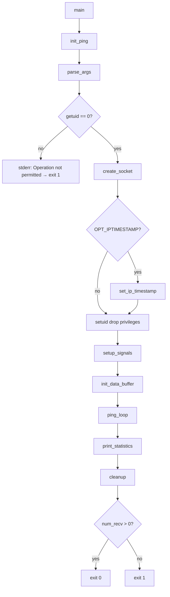
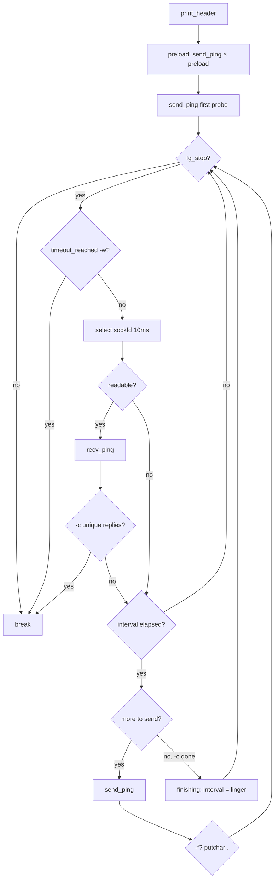
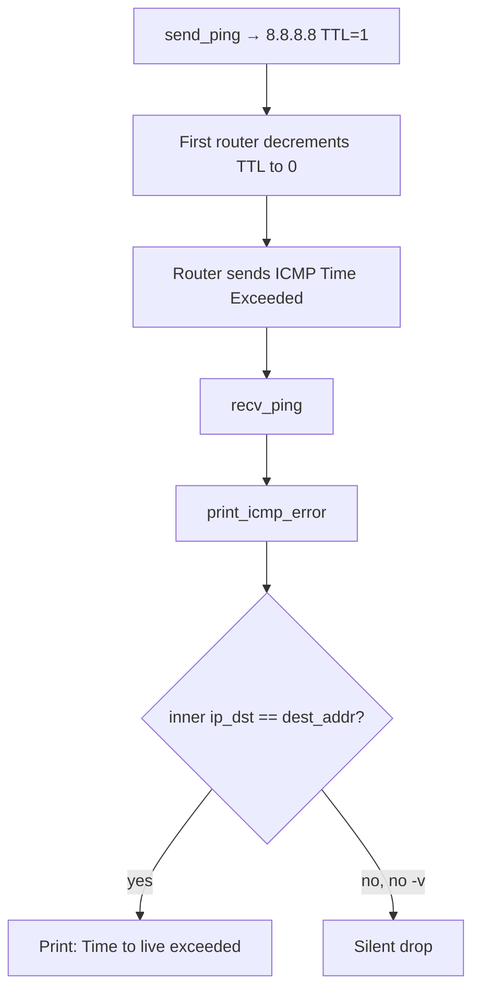

# Command flow

For each CLI command in [TESTING.md](TESTING.md), this page traces **what happens inside `ft_ping`**: which functions run, which `t_ping` fields change, and where the program stops.

Related: [ARCHITECTURE.md](ARCHITECTURE.md) (module map), [FLAGS.md](FLAGS.md) (flag semantics), [concepts/README.md](concepts/README.md) (protocol details).

---

## Shared startup (all commands except help)

Every run that reaches the network path follows the same order in `main()` (`srcs/main.c`):



| Step | File | What happens |
|------|------|----------------|
| `init_ping()` | `main.c` | Zero `t_ping`; defaults: `data_length=56`, `ttl=64`, `interval=1s`, `linger=10`, `ident=getpid()&0xFFFF` |
| `parse_args()` | `main.c`, `dns.c` | `getopt_long` → `handle_option()`; positional host → `resolve_host()` |
| `create_socket()` | `socket.c` | `socket(AF_INET, SOCK_RAW, IPPROTO_ICMP)` + `set_sock_options()` |
| `set_ip_timestamp()` | `socket.c` | Only if `--ip-timestamp`; `setsockopt(IP_OPTIONS)` |
| `setuid()` | `main.c` | Drop effective root after socket is open |
| `init_data_buffer()` | `send.c` | Allocate/fill payload (`-p` pattern or auto `i&0xFF`); skip if `-s 0` |
| `ping_loop()` | `main.c` | Send/receive until stop condition |
| `print_statistics()` | `stats.c` | Final summary block |

### Shared main loop

`ping_loop()` (`main.c`) is the same skeleton for every live ping:



| Function | File | Role |
|----------|------|------|
| `send_ping()` | `send.c` | Build ICMP echo, `sendto()`, `num_xmit++`, `seq++` |
| `recv_ping()` | `recv.c` | `recvmsg()` → parse IP → dispatch echo reply or ICMP error |
| `print_echo_reply()` | `print.c` | Reply line, RTT, duplicates, IP options |
| `print_icmp_error()` | `print.c` | TTL exceeded, unreachable, etc. |
| `timeout_reached()` | `main.c` | Wall-clock limit from `-w` |
| `g_stop` | `signal.c` | Set by SIGINT (Ctrl+C) |

**Stop conditions** (any one ends the loop):

| Trigger | Mechanism |
|---------|-----------|
| Ctrl+C | `g_stop = 1` via `sig_int_handler()` |
| `-c N` | `(num_recv - num_rept) >= N` after a reply |
| `-w N` | `timeout_reached()` — elapsed seconds ≥ `timeout` |
| After `-c` sends done | `finishing` phase: wait up to `-W` seconds (`linger`) for late replies, then break |
| `select` error | Break (not EINTR) |

---

## Mandatory tests

### `./ft_ping -?` / `./ft_ping --help`

**No network path.**


| Detail | Code |
|--------|------|
| Parsed in | `parse_args()` — `opt == '?'` with no `optopt` error |
| Output | `print_usage()` |
| Root required | **No** — exits before `getuid()` check |
| Socket | Not created |

Invalid option (`./ft_ping -z`): `invalid option` + usage → **exit 1**.

---

### `sudo ./ft_ping 127.0.0.1` (basic IPv4)

Default session: no extra flags.

| Phase | Flow |
|-------|------|
| Parse | `resolve_host("127.0.0.1")` — literal IPv4, no DNS query |
| Socket | `IP_TTL=64`, no TOS, no `SO_DONTROUTE`, no IP options |
| Buffer | `data_length=56`; `init_data_buffer()` fills bytes `0x00..0x37` |
| Loop | 1 probe/s; `print_header` → `PING 127.0.0.1 (127.0.0.1): 56 data bytes` |
| Send | ICMP type 8, `ident=pid&0xFFFF`, `seq` 0,1,2…; first 16 payload bytes = `gettimeofday` |
| Recv | `recv_ping` → echo reply + matching `ident` → `print_echo_reply` |
| Output | `64 bytes from 127.0.0.1: icmp_seq=N ttl=64 time=… ms` |
| Stop | Ctrl+C → `g_stop` → `print_statistics` |

See [GETADDRINFO.md](concepts/GETADDRINFO.md) (numeric host), [ICMP.md](concepts/ICMP.md), [RECV.md](concepts/RECV.md).

---

### `sudo ./ft_ping google.com` (hostname / FQDN)

Same as basic ping; only resolution and header text differ.

| Step | Function | Effect |
|------|----------|--------|
| Resolve | `resolve_host()` → `getaddrinfo(AF_INET, …)` | DNS **A record** lookup |
| Store | `ping->hostname` | `strdup("google.com")` — string you typed |
| Store | `ping->ip_str`, `ping->dest_addr` | Resolved IPv4 for header and `sendto` |
| Header | `print_header()` | `PING google.com (142.250.x.x): 56 data bytes` |
| Replies | `print_echo_reply()` | `bytes from <IP>` only — **no reverse DNS** |

---

### `sudo ./ft_ping -v -c 2 127.0.0.1` (verbose)

| Flag | Where set | Where read |
|------|-----------|------------|
| `-v` | `handle_option` → `options \|= OPT_VERBOSE` | `print_header`, `print_icmp_error` |
| `-c 2` | `ping->count = 2` | `ping_loop` stop after 2 **unique** replies |

**Extra flow vs default:**

1. `print_header` adds `, id 0xHHHH = NNNN` (`stats.c`).
2. ICMP errors about your probes always print; unrelated errors filtered unless `-v` (see TTL test).
3. On errors, `print_inner_ip_data()` → `IP Hdr Dump:` block (`print.c`).
4. Loop exits when `(num_recv - num_rept) >= 2`, then statistics.

---

### `sudo ./ft_ping --ttl 1 -c 3 8.8.8.8` (TTL exceeded)

| Flag | Code path |
|------|-----------|
| `--ttl 1` | `handle_option(OPT_TTL)` → `ping->ttl = 1` → `setsockopt(IP_TTL)` in `set_sock_options()` |
| `-c 3` | Stop after 3 unique replies (may never happen — 100% loss) |

**Error path (no `-v`):**



| Step | Detail |
|------|--------|
| Send | Kernel sets `ip_ttl=1` on outgoing IP header |
| Receive | `ICMP_HDR_TYPE != ECHOREPLY` → `print_icmp_error()` |
| Filter | Without `-v`, only errors whose **quoted inner packet** targets `dest_addr` |
| Count | Errors do **not** increment `num_recv` — only echo replies do |
| Exit | `-c 3` may time out on receives; `-w` or Ctrl+C also stops; `exit 1` if zero replies |

See [TTL.md](concepts/TTL.md), [ICMP.md](concepts/ICMP.md).

---

### `sudo ./ft_ping -v --ttl 1 -c 3 8.8.8.8` (TTL exceeded + verbose)

Same as above, plus:

| `-v` effect | Function |
|-------------|----------|
| Show unrelated errors | Skips inner-destination filter in `print_icmp_error` |
| Dump inner probe | `print_inner_ip_data()` → hex dump + inner protocol line |

---

## Output format tests

### `sudo ./ft_ping -c 3 127.0.0.1` (statistics block)

Exercises the normal echo-reply path three times, then shutdown statistics.

| Counter | Updated in |
|---------|------------|
| `num_xmit` | `send_ping()` each send |
| `num_recv` | `print_echo_reply()` each reply (including duplicates) |
| `num_rept` | `print_echo_reply()` when `check_duplicate()` finds same `seq` |
| RTT min/avg/max/stddev | `update_timing()` in `print.c`; only if `data_length >= 16` |

**End of run:** `print_statistics()` (`stats.c`):

```
--- 127.0.0.1 ping statistics ---
3 packets transmitted, 3 packets received, 0% packet loss
round-trip min/avg/max/stddev = …/…/…/… ms
```

`-c 3` stop: unique replies `(num_recv - num_rept) >= 3`, then optional `-W` linger phase if more sends were in flight.

---

## Bonus flag tests

### `sudo ./ft_ping -c 1 127.0.0.1`

| Field | Value |
|-------|-------|
| `count` | `1` |

Loop sends until one **non-duplicate** reply; `finishing` may wait up to `linger` (default 10 s) for stragglers; then statistics and exit.

---

### `sudo ./ft_ping -s 0 -c 1 127.0.0.1`

| Flag | Code path |
|------|-----------|
| `-s 0` | `data_length = 0` |

| Effect | Detail |
|--------|--------|
| `init_data_buffer()` | Returns immediately — no `data_buffer` |
| `send_ping()` | Packet size = 8 bytes (ICMP header only); no embedded timestamp |
| `print_echo_reply()` | `8 bytes from …`; no `time=…` (`timing` false) |
| `print_statistics()` | No RTT line (`data_length < sizeof(timeval)`) |
| Header | `PING …: 0 data bytes` |

---

### `sudo ./ft_ping -s 56 -c 1 127.0.0.1`

Default payload size (explicit). Reply line: `64 bytes` = 8 ICMP header + 56 data.

---

### `sudo ./ft_ping -s 1000 -c 1 127.0.0.1`

| Step | Detail |
|------|--------|
| `data_length` | `1000` |
| `init_data_buffer()` | 1000-byte buffer |
| `send_ping()` | `pkt_sz = 8 + 1000` |
| Reply | `1008 bytes from …` (ICMP header + echoed payload) |

---

### `sudo ./ft_ping -w 2 8.8.8.8`

| Flag | Code path |
|------|-----------|
| `-w 2` | `ping->timeout = 2` |

Each loop iteration: `timeout_reached()` compares `now - start_time` ≥ 2 seconds → **break** regardless of `-c`. Statistics printed; exit `1` if no replies.

---

### `sudo ./ft_ping -c 2 -W 3 8.8.8.8` (linger)

| Flag | Code path |
|------|-----------|
| `-W 3` | `ping->linger = 3` |

After `num_xmit >= count` (2 sends done), `ping_loop` enters **finishing**:

1. `finishing = 1`
2. `interval = linger * 1_000_000` µs (3 seconds)
3. No more sends; only `recv_ping` until interval elapses
4. Then break → statistics

Use case: wait for slow replies after the last probe.

---

### `sudo ./ft_ping --ttl 64 -c 1 8.8.8.8`

Same as default TTL (64). Confirms `setsockopt(IP_TTL, 64)` — normal echo replies, `ttl=` in reply line reflects decrements along path.

---

### `sudo ./ft_ping -T 0 -c 1 127.0.0.1` / `-T 16`

| Flag | Code path |
|------|-----------|
| `-T N` | `ping->tos = N` |

In `set_sock_options()`: if `tos >= 0`, `setsockopt(IP_TOS)`. Default `tos = -1` → option **not** set.

No change to send/recv logic; kernel may ignore TOS on some networks.

See [TOS.md](concepts/TOS.md).

---

### `sudo ./ft_ping -p ff -s 56 -c 1 127.0.0.1`

| Flag | Code path |
|------|-----------|
| `-p ff` | `decode_pattern()` → `pattern[0]=0xFF`, `pattern_set=true` |

`init_data_buffer()`: every payload byte = `pattern[i % pattern_len]` → all `0xFF`.

`send_ping()`: copies buffer after the 16-byte timestamp slot into the packet.

---

### `sudo ./ft_ping -p 001122…eeff -s 56 -c 1 127.0.0.1`

Long hex string → `decode_pattern()` fills up to `MAXPATTERN` bytes; buffer tiled in `init_data_buffer()`.

---

### `sudo ./ft_ping -p zz 127.0.0.1` (invalid pattern)

**Exits during parse — no socket.**


---

### `sudo ./ft_ping -f -c 100 127.0.0.1` (flood)

| Flag | Code path |
|------|-----------|
| `-f` | `options \|= OPT_FLOOD`; `interval = PING_FLOOD_INTERVAL` (10 ms) |

| Location | Behavior |
|----------|----------|
| `ping_loop` | After each send: `putchar('.')` |
| `print_echo_reply` | `putchar('\b')` — erase one dot; **no** reply line |

Statistics still printed at end; `-c` still limits unique replies.

---

### `sudo ./ft_ping -l 10 -c 10 127.0.0.1` (preload)

| Flag | Code path |
|------|-----------|
| `-l 10` | `preload = 10` |

Before the main loop timer:

```c
while (i < ping->preload) { send_ping(ping); i++; }
send_ping(ping);   /* 11th packet, then interval timing starts */
```

First 10 packets with **no delay**; then normal 1 s interval (or flood interval if `-f`).

---

### `sudo ./ft_ping -r -c 1 127.0.0.1` (bypass routing)

| Flag | Code path |
|------|-----------|
| `-r` | `g_dontroute = 1` in `parse_args` |

`set_sock_options()` → `setsockopt(SO_DONTROUTE)`. Packets must reach target without routing table (works for `127.0.0.1`; remote hosts may fail at send or receive).

---

### `sudo ./ft_ping -n -c 1 google.com` (numeric)

| Flag | Code path |
|------|-----------|
| `-n` | **No-op** in `handle_option()` (empty branch) |

`ft_ping` never performs reverse DNS on replies — reply lines always use `inet_ntoa(from->sin_addr)`. `-n` is accepted for inetutils parity; behavior matches default for this implementation.

Forward DNS still runs in `resolve_host()` for the hostname operand.

---

### `sudo ./ft_ping --ip-timestamp tsonly -c 1 8.8.8.8`

| Flag | Code path |
|------|-----------|
| `--ip-timestamp tsonly` | `options \|= OPT_IPTIMESTAMP`; `ip_ts_type = SOPT_TSONLY` |

After `create_socket()`:

```c
set_ip_timestamp()  →  setsockopt(IP_OPTIONS) with IPOPT_TS / TSONLY
```

On reply, `print_echo_reply()` → `print_ip_opt()` may print `TS:` block if routers echoed timestamps. Many networks drop IP options → loss, no crash.

---

### `sudo ./ft_ping --ip-timestamp tsaddr -c 1 8.8.8.8`

Same as `tsonly`, but `ip_ts_type = SOPT_TSADDR` → `IPOPT_TS_TSANDADDR` in `set_ip_timestamp()`. `print_ip_opt_ts()` may print address + timestamp pairs.

---

## Negative / robustness tests

### `./ft_ping` (missing host)


No socket, no root check reached if parse fails first — actually root check is after parse, so **root check still runs**. Missing host exits in `parse_args` before return to `main` socket path.

---

### `./ft_ping does-not-exist.invalid`

`resolve_host()` → `getaddrinfo` fails → `unknown host` → **exit 1**. No socket.

---

### `./ft_ping 127.0.0.1` (no root)

`parse_args` succeeds → `getuid() != 0` → `socket: Operation not permitted` → **exit 1**. No socket created.

---

## Quick reference: flag → field → function

| Test command flag | `t_ping` / global | First function that applies it |
|-------------------|-------------------|-------------------------------|
| `-?` / `--help` | — | `print_usage()` (early exit) |
| `-v` | `options \| OPT_VERBOSE` | `print_header`, `print_icmp_error` |
| `-c` | `count` | `ping_loop` stop condition |
| `-s` | `data_length` | `init_data_buffer`, `send_ping`, `print_echo_reply` |
| `-w` | `timeout` | `timeout_reached()` |
| `-W` | `linger` | `ping_loop` finishing phase |
| `--ttl` | `ttl` | `set_sock_options(IP_TTL)` |
| `-T` | `tos` | `set_sock_options(IP_TOS)` if ≥ 0 |
| `-p` | `pattern[]`, `pattern_set` | `decode_pattern`, `init_data_buffer` |
| `-f` | `options \| OPT_FLOOD`, `interval` | `ping_loop`, `print_echo_reply` |
| `-l` | `preload` | `ping_loop` preload loop |
| `-r` | `g_dontroute` | `set_sock_options(SO_DONTROUTE)` |
| `-n` | (none) | — |
| `--ip-timestamp` | `options \| OPT_IPTIMESTAMP`, `ip_ts_type` | `set_ip_timestamp`, `print_ip_opt` |
| host operand | `hostname`, `ip_str`, `dest_addr` | `resolve_host()` |
| Ctrl+C | `g_stop` | `sig_int_handler`, `ping_loop` |
