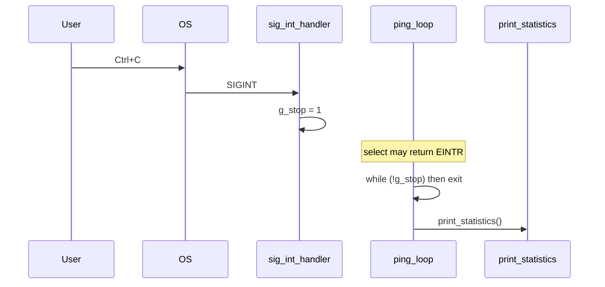

# Signals and Ctrl+C in `ft_ping`

**ft_ping** runs until the user presses **Ctrl+C**, a limit flag fires (`-c`, `-w`, `-W`), or an unrecoverable error occurs. **Ctrl+C** sends **SIGINT** to the process. Instead of terminating immediately, the program sets a global flag **`g_stop`** and exits the main loop cleanly so **statistics** are always printed.

Implementation: `srcs/signal.c`, global `g_stop` in `srcs/main.c`, loop in `ping_loop()`.

Related: [ARCHITECTURE.md](../ARCHITECTURE.md) (main loop), [FLAGS.md](../FLAGS.md) (stop conditions).

---

## Full source: `signal.c`

```c
#include "ft_ping.h"

static void	sig_int_handler(int sig)
{
	(void)sig;
	g_stop = 1;
}

void	setup_signals(void)
{
	struct sigaction	sa;

	memset(&sa, 0, sizeof(sa));
	sa.sa_handler = sig_int_handler;
	sigemptyset(&sa.sa_mask);
	sa.sa_flags = 0;
	if (sigaction(SIGINT, &sa, NULL) < 0)
	{
		fprintf(stderr, "ft_ping: sigaction: %s\n", strerror(errno));
		exit(EXIT_FAILURE);
	}
}
```

Global flag (`srcs/main.c`):

```c
volatile sig_atomic_t	g_stop = 0;
```

Declaration (`includes/ft_ping.h`):

```c
extern volatile sig_atomic_t	g_stop;
```

---

## What problem this solves

Default SIGINT behavior can **kill** the process before `print_statistics()` runs. inetutils `ping` prints the summary block after `^C`; **ft_ping** matches that.

Desired flow:

```
User presses Ctrl+C
        │
        ▼
OS delivers SIGINT
        │
        ▼
sig_int_handler()  →  g_stop = 1
        │
        ▼
ping_loop() sees !g_stop is false  →  break
        │
        ▼
print_statistics()
cleanup()
exit (0 or 1 by num_recv)
```

Terminal example:

```
64 bytes from 127.0.0.1: icmp_seq=2 ttl=64 time=0.038 ms
^C
--- 127.0.0.1 ping statistics ---
3 packets transmitted, 3 packets received, 0% packet loss
...
```

---

## `g_stop`: why global, `volatile`, `sig_atomic_t`

| Piece | Reason |
|-------|--------|
| **Global** | Signal handler is a plain C function — it does not receive `t_ping *`. One flag is enough: “stop the loop”. |
| **`sig_atomic_t`** | POSIX guarantees that read/write of this type is **atomic** — safe between handler and main thread without a mutex. |
| **`volatile`** | Tells the compiler: “this variable can change outside normal flow” — `while (!g_stop)` must re-read `g_stop` each iteration, not cache it in a register. |

The handler only does **`g_stop = 1`** — the minimum safe side effect.

### What must **not** run in a signal handler

Avoid in `sig_int_handler` (and why):

| Unsafe | Why |
|--------|-----|
| `printf` / `fprintf` | Not async-signal-safe; can deadlock if interrupted mid-stdio |
| `malloc` / `free` | Heap may be inconsistent |
| `exit` (except `_exit` in extreme cases) | Can corrupt state |
| Most libc calls | Undefined behavior if re-entered |

Statistics printing stays in **normal** code after the loop — not in the handler.

---

## `setup_signals()` line by line

| Line | Code | Meaning |
|------|------|---------|
| 9 | `void setup_signals(void)` | Called once from `main()` before `ping_loop()`. |
| 11 | `struct sigaction sa` | Describes how to handle one signal type. |
| 13 | `memset(&sa, 0, sizeof(sa))` | Zero the struct; unset fields use defaults. |
| 14 | `sa.sa_handler = sig_int_handler` | On SIGINT, call our function instead of default terminate. |
| 15 | `sigemptyset(&sa.sa_mask)` | Do not block other signals while the handler runs. |
| 16 | `sa.sa_flags = 0` | No `SA_RESTART` — interrupted `select()` returns `EINTR` (see below). |
| 17 | `sigaction(SIGINT, &sa, NULL)` | Install handler for **SIGINT** (Ctrl+C). Third arg `NULL` = do not save old action. |
| 18–20 | error path | If install fails, print error and `exit(EXIT_FAILURE)` — cannot rely on Ctrl+C behavior. |

### Why `sigaction` instead of `signal()`

`sigaction(2)` is the POSIX API: predictable behavior across platforms, full control over masks and flags. Legacy `signal()` is discouraged for new code.

---

## `sig_int_handler()` line by line

| Line | Code | Meaning |
|------|------|---------|
| 3 | `static void sig_int_handler(int sig)` | `sig` is the signal number (unused here). `static` = file-local. |
| 5 | `(void)sig` | Silence unused-parameter warnings. |
| 6 | `g_stop = 1` | Request graceful shutdown; main loop will exit. |

No return value matters — handler type is `void (*)(int)`.

---

## Where `g_stop` is read

### `ping_loop()` — primary consumer

```c
while (!g_stop)
{
    ...
    if (!g_stop && elapsed_us >= ping->interval)
        send_ping(ping);
}
```

When `g_stop` becomes `1`, the next loop condition fails and the function returns.

### Double check before send

```c
if (!g_stop && elapsed_us >= ping->interval)
```

Avoids sending **one extra** packet if Ctrl+C arrives between the `while` test and the send branch in the same iteration (edge case; cheap guard).

---

## SIGINT and `select()`: `EINTR`

`ping_loop` waits with:

```c
ret = select(ping->sockfd + 1, &readfds, NULL, NULL, &tv);
if (ret < 0)
{
    if (errno == EINTR)
        continue;
    break;
}
```

When SIGINT arrives during `select`:

1. Handler runs → `g_stop = 1`.
2. `select` returns `-1` with `errno == EINTR` (interrupted by signal).
3. Loop `continue`s — next iteration sees `g_stop` and exits.

With `sa.sa_flags = 0` (no `SA_RESTART`), `select` does **not** restart automatically — the loop can react immediately.

---

## When `setup_signals()` runs in `main()`

```
create_socket()
set_ip_timestamp()?   /* if --ip-timestamp */
setuid(getuid())      /* drop root */
setvbuf(stdout, …)
setup_signals()       ← here
init_data_buffer()
ping_loop()           ← reads g_stop
print_statistics()
cleanup()
```

Signals are installed **before** `ping_loop` (where Ctrl+C matters) and **after** privileged setup. `init_data_buffer` is fast; the critical window is the long-running loop.

---

## All ways the session stops

| Cause | Mechanism | Statistics? |
|-------|-----------|-------------|
| **Ctrl+C** | `g_stop = 1` via SIGINT | Yes |
| **`-c` met** | `break` in `ping_loop` when enough unique replies | Yes |
| **`-w` expired** | `timeout_reached()` → `break` | Yes |
| **`-W` / finishing** | After all sends, linger elapsed → `break` | Yes |
| **`select` hard error** | `break` (not EINTR) | Yes |
| **Parse / socket errors** | `exit` before loop | No (or N/A) |
| **`sigaction` fails** | `exit` in `setup_signals` | No |

Only SIGINT uses the signal module; other stops are normal control flow in `main.c`.

---

## Flow diagram



---

## Comparison with other stop flags

| | Ctrl+C (`g_stop`) | `-c` | `-w` | `-W` |
|---|-------------------|------|------|------|
| **Sets** | `g_stop` | reply count | wall clock | linger after last send |
| **Checked** | every loop iteration | after `recv_ping` | start of iteration | `finishing` phase |
| **User intent** | stop now | N replies | max seconds | wait for late replies |

They can combine; whichever condition is met first ends `ping_loop`.

---

## Manual pages

- `sigaction(2)` — install signal handler
- `signal(7)` — signal overview, async-signal-safe functions
- `sig_atomic_t` — type in `<signal.h>`
