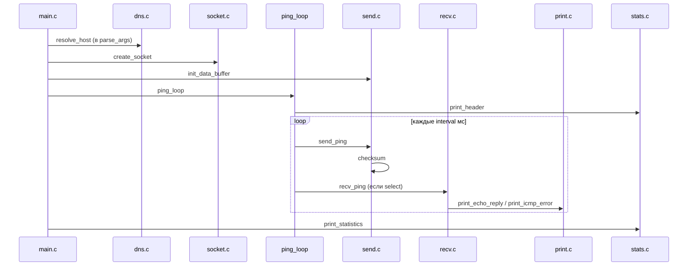

# Архитектура `ft_ping`

Документ объясняет **устройство проекта**, **протоколы и структуры данных**, **порядок работы во время выполнения** и **связи между модулями**.

`ft_ping` — реализация утилиты `ping` на C с нуля. Программа:

- формирует ICMP **Echo Request** (тип 8);
- отправляет их по IPv4 через **raw-сокет**;
- принимает **Echo Reply** (тип 0) и ICMP **сообщения об ошибках** (типы 3, 5, 11 и др.);
- измеряет RTT (round-trip time) и печатает итоговую статистику при выходе.

Формат вывода соответствует **inetutils-2.0** (эталонный `ping -V` на Debian).

---

## Содержание

1. [Ограничения и требования](#ограничения-и-требования)
2. [Структура файлов](#структура-файлов)
3. [Протокол: что именно ходит по сети](#протокол-что-именно-ходят-по-сети)
4. [Структура `t_ping` и константы](#структура-t_ping-и-константы)
5. [Полный порядок запуска `main()`](#полный-порядок-запуска-main)
6. [Модули по файлам](#модули-по-файлам)
7. [Главный цикл: машина состояний](#главный-цикл-машина-состояний)
8. [Отправка: сборка ICMP-пакета](#отправка-сборка-icmp-пакета)
9. [Приём: разбор IP и ICMP](#приём-разбор-ip-и-icmp)
10. [Вывод: ответы, ошибки, IP-опции](#вывод-ответы-ошибки-ip-опции)
11. [Статистика и математика RTT](#статистика-и-математика-rtt)
12. [Все флаги командной строки](#все-флаги-командной-строки)
13. [Диаграммы взаимодействия](#диаграммы-взаимодействия)
14. [Кроссплатформенность](#кроссплатформенность)
15. [Сборка](#сборка)

---

## Ограничения и требования

| Ограничение | Следствие в коде |
|-------------|------------------|
| Raw-сокет `SOCK_RAW` + `IPPROTO_ICMP` | Запуск только от root (`sudo`) |
| Спецификация | Один хост; без reverse DNS в ответах; вывод как у inetutils |
| Сеть ненадёжна | Потери, дубликаты, reorder; фильтрация IP-опций |
| `-Wall -Wextra -Werror` | Строгая компиляция без предупреждений |

**Почему raw, а не обычный сокет:** программа сама собирает ICMP-заголовок (type, code, id, seq, checksum, данные). Ядро при отправке дописывает IP-заголовок. При приёме raw-сокет отдаёт **целый IP-пакет** — программа видит и IP, и ICMP.

**Почему `setuid` после `socket`:** сокет уже открыт с правами root; дальше процесс сбрасывает эффективный UID до реального пользователя, чтобы не работать с лишними привилегиями во время цикла ping.

---

## Структура файлов

```
ft_ping/
├── includes/
│   └── ft_ping.h      # типы, константы, макросы ICMP, прототипы
├── srcs/
│   ├── main.c         # main, parse_args, ping_loop, условия остановки
│   ├── dns.c          # resolve_host — getaddrinfo IPv4
│   ├── socket.c       # create_socket, set_sock_options, set_ip_timestamp
│   ├── send.c         # init_data_buffer, send_ping
│   ├── recv.c         # recv_ping — recvmsg и диспетчеризация
│   ├── print.c        # print_echo_reply, print_icmp_error, IP-опции
│   ├── stats.c        # print_header, print_statistics
│   ├── checksum.c     # checksum — RFC 1071
│   ├── signal.c       # setup_signals — SIGINT → g_stop
│   └── utils.c        # parse_number, decode_pattern, calc_stddev
├── Makefile
└── docs/
    └── ru/            # документация на русском
```

Зависимости между `.c`-файлами линейные: все включают только `ft_ping.h`. Связь идёт через общий объект `t_ping` и глобальный `g_stop`.

---

## Протокол: что именно ходят по сети

### Исходящий пакет (Echo Request)

Программа передаёт в `sendto()` **только ICMP-сообщение**. Ядро оборачивает его в IP:

```
┌──────────────────────────────────────────────────────────────┐
│  IP-заголовок (ядро)                                         │
│  src = IP машины, dst = цель, TTL = --ttl, TOS = -T         │
│  опционально: IP Timestamp (--ip-timestamp)                  │
├──────────────────────────────────────────────────────────────┤
│  ICMP Echo Request (8 байт заголовок + payload)              │
│  ┌────────┬──────┬─────────┬─────────┬──────────┬─────────┐ │
│  │ type=8 │code=0│ checksum│ id (PID)│ sequence │  data   │ │
│  └────────┴──────┴─────────┴─────────┴──────────┴─────────┘ │
│                              ↑                    ↑          │
│                         ping->ident           ping->seq      │
│                              первые sizeof(timeval) байт     │
│                              data = gettimeofday()           │
└──────────────────────────────────────────────────────────────┘
```

| Поле ICMP | Значение в `ft_ping` |
|-----------|----------------------|
| type | `ICMP_ECHO` (8) |
| code | 0 |
| id | `getpid() & 0xFFFF` — отличает пакеты этой сессии от чужих |
| sequence | инкрементируется после каждой успешной отправки |
| checksum | RFC 1071 по всему ICMP-сообщению |
| data | `struct timeval` + шаблон из `data_buffer` |

Строка `64 bytes from ...` в ответе — это **ICMP + data** (8 + 56 по умолчанию), а не весь IP-пакет.

### Входящий Echo Reply

Удалённый хост (или localhost) отвечает типом **0** (`ICMP_ECHOREPLY`) с тем же `id` и `seq`. Payload содержит тот же timestamp — по нему считается RTT.

### Входящее ICMP-сообщение об ошибке

Если пакет не доходит (TTL истёк, сеть недоступна и т.д.), **промежуточный маршрутизатор или хост** шлёт ICMP error. Структура:

```
┌────────────────────────────────────────┐
│  IP-заголовок (внешний)                │
├────────────────────────────────────────┤
│  ICMP error (type 3, 11, …)            │
│  ┌──────┬──────┬─────────┬────────────┐│
│  │ type │ code │ checksum│  unused    ││
│  └──────┴──────┴─────────┴────────────┘│
│  ┌────────────────────────────────────┐│
│  │ «Quoted» — копия IP + начало ICMP  ││  ← наш исходный пакет
│  │  внутренний IP.dst должен = цель   ││
│  └────────────────────────────────────┘│
└────────────────────────────────────────┘
```

`print_icmp_error()` без `-v` показывает ошибку **только если** `inner_ip->ip_dst` совпадает с текущей целью — иначе чужие ICMP-ошибки из сети не засоряют вывод.

---

## Структура `t_ping` и константы

### `t_ping` — единое состояние сессии

```c
typedef struct s_ping {
    int                 sockfd;           // raw ICMP socket

    struct sockaddr_in  dest_addr;        // IPv4 назначения
    char               *hostname;         // аргумент CLI (google.com)
    char                ip_str[INET_ADDRSTRLEN];  // "142.250.185.46"

    size_t              num_xmit;         // счётчик sendto
    size_t              num_recv;         // все принятые Echo Reply
    size_t              num_rept;         // из них дубликаты
    unsigned char       recv_table[PING_CKTAB_SZ];  // 128 байт = 1024 seq

    uint16_t            ident;            // ICMP identifier
    uint16_t            seq;              // следующий sequence number

    unsigned int        options;          // битовые флаги OPT_*
    size_t              data_length;      // размер payload (не считая 8 байт ICMP)
    int                 ttl;              // IP TTL
    int                 tos;              // IP TOS (-1 = не задан)
    size_t              count;            // -c (0 = бесконечно)
    long                interval;         // мкс между отправками
    int                 timeout;          // -w, секунды (-1 = нет)
    int                 linger;           // -W, ожидание после последней отправки
    unsigned long       preload;          // -l

    unsigned char       pattern[MAXPATTERN];  // до 16 байт для -p
    int                 pattern_len;
    bool                pattern_set;

    unsigned int        ip_ts_type;       // SOPT_TSONLY / SOPT_TSADDR
    unsigned char      *data_buffer;      // шаблон payload

    struct timeval      start_time;       // для -w
    t_ping_stat         stats;            // min, max, sum, sumsq RTT
} t_ping;
```

### Важные константы (`ft_ping.h`)

| Константа | Значение | Смысл |
|-----------|----------|-------|
| `PING_PKT_DATA_SZ` | 56 | payload по умолчанию |
| `PING_PKT_HDR_SZ` | 8 | размер ICMP-заголовка |
| `RECV_BUFSIZE` | 65536 | буфер приёма |
| `PING_DEFAULT_TTL` | 64 | TTL по умолчанию |
| `PING_DEFAULT_INTERVAL` | 1 000 000 | 1 секунда между пакетами (мкс) |
| `PING_FLOOD_INTERVAL` | 10 000 | 10 мс в режиме `-f` |
| `PING_CKTAB_SZ` | 128 | битовая таблица seq (1024 номера) |
| `MAXPATTERN` | 16 | макс. длина hex-паттерна `-p` |

### Глобальные переменные

| Имя | Тип | Роль |
|-----|-----|------|
| `g_stop` | `volatile sig_atomic_t` | 1 после Ctrl+C |
| `g_dontroute` | `int` | 1 если передан `-r` (вне `t_ping`, т.к. читается в `socket.c`) |

`volatile sig_atomic_t` для `g_stop` — корректная запись из обработчика сигнала без гонок с главным циклом.

---

## Полный порядок запуска `main()`

```
main(argc, argv)
│
├─ init_ping(&ping)              // значения по умолчанию
├─ parse_args(&ping, ...)        // getopt_long + resolve_host
│     └─ при -? → print_usage, exit(0)  БЕЗ root
│
├─ if (getuid() != 0) → ошибка "Operation not permitted"
├─ create_socket(&ping)          // SOCK_RAW + setsockopt
├─ if (OPT_IPTIMESTAMP) set_ip_timestamp(&ping)
├─ setuid(getuid())              // сброс root после открытия сокета
├─ setvbuf(stdout, _IOLBF)       // построчная буферизация stdout
├─ setup_signals()               // SIGINT → g_stop = 1
├─ init_data_buffer(&ping)       // malloc шаблона payload
├─ ping_loop(&ping)              // основная работа
├─ print_statistics(&ping)       // итог при любом выходе
├─ cleanup(&ping)                // close, free hostname, free data_buffer
└─ return (num_recv == 0) ? FAILURE : SUCCESS
```

Порядок критичен: **аргументы и DNS до root**, **сокет до setuid**, **сигналы до цикла**, **статистика после цикла** (в т.ч. при Ctrl+C).

---

## Модули по файлам

### `main.c`

| Функция | Назначение |
|---------|------------|
| `init_ping` | Обнуление `t_ping`, дефолты (56 байт, TTL 64, interval 1 с, ident из PID) |
| `print_usage` | Текст справки `-?` |
| `handle_option` | Разбор одной короткой/длинной опции в поля `t_ping` |
| `parse_args` | `getopt_long`, один хост, вызов `resolve_host` |
| `timeout_reached` | Проверка `-w`: прошло ли N секунд от `start_time` |
| `ping_loop` | Preload, первый пакет, цикл select/send/recv |
| `cleanup` | Закрытие сокета, освобождение памяти |
| `main` | Оркестрация всего выше |

### `dns.c`

| Функция | Назначение |
|---------|------------|
| `resolve_host` | `getaddrinfo(host, AF_INET)` → `dest_addr`, `ip_str`, `strdup(hostname)` |

Подсказки для `getaddrinfo`: `ai_family = AF_INET`, `ai_socktype = SOCK_RAW`, `ai_protocol = IPPROTO_ICMP`. Reverse DNS при приёме **нигде не вызывается**.

### `socket.c`

| Функция | Назначение |
|---------|------------|
| `set_sock_options` | `SO_BROADCAST`, `IP_TTL`, `IP_TOS`, `SO_DONTROUTE`, `SO_RCVTIMEO` |
| `set_ip_timestamp` | `IP_OPTIONS` — опция timestamp в исходящих IP-пакетах |
| `create_socket` | `socket()` + `set_sock_options` |

### `send.c`

| Функция | Назначение |
|---------|------------|
| `init_data_buffer` | `malloc(data_length)`, заполнение паттерном или 00 01 02 … |
| `send_ping` | Сборка ICMP, checksum, `sendto`, `num_xmit++`, `seq++` |

### `recv.c`

| Функция | Назначение |
|---------|------------|
| `recv_ping` | `recvmsg`, парсинг IP/ICMP, вызов `print_echo_reply` или `print_icmp_error` |

Фильтрация: Echo Reply только с `id == ping->ident`; ICMP Echo Request (чужие) игнорируются; остальные ICMP-типы → ошибки.

### `print.c`

| Функция | Назначение |
|---------|------------|
| `print_echo_reply` | RTT, дубликаты, строка ответа, IP-опции |
| `print_icmp_error` | Текст ошибки + опционально verbose dump |
| `print_ip_opt` | Разбор TS, RR, NOP, unknown в IP-заголовке ответа |
| `print_ip_header_dump` | Hex-дамп IP (только `-v`) |
| `print_inner_protocol` | TCP/UDP/ICMP внутри quoted packet |

### `stats.c`

| Функция | Назначение |
|---------|------------|
| `print_header` | `PING host (ip): N data bytes` [, id при `-v`] |
| `print_statistics` | Блок `--- host ping statistics ---` |

### `checksum.c`

| Функция | Назначение |
|---------|------------|
| `checksum` | 16-битная дополняющая сумма по RFC 1071 |

### `signal.c`

| Функция | Назначение |
|---------|------------|
| `setup_signals` | `sigaction(SIGINT)` → `g_stop = 1` |
| `sig_int_handler` | Минимальный обработчик без небезопасных вызовов |

### `utils.c`

| Функция | Назначение |
|---------|------------|
| `parse_number` | `strtol` с проверкой диапазона для `-c`, `-s`, `--ttl` и др. |
| `decode_pattern` | Парсинг hex для `-p` (нечётное число символов → младший полубайт 0) |
| `calc_stddev` | `sqrt(tsumsq/n - (tsum/n)²)` |

---

## Главный цикл: машина состояний

`ping_loop()` — сердце программы. Однопоточная модель: нет отдельных потоков на send/recv.

### Фаза 0: старт

1. `gettimeofday(&ping->start_time)` — отсчёт для `-w`.
2. `print_header(ping)`.
3. Цикл `preload` раз: `send_ping` без паузы (`-l`).
4. Ещё один `send_ping` — первый «обычный» пакет.
5. Запомнить `last_send` для таймера интервала.

### Фаза 1: основной цикл (`while (!g_stop)`)

На каждой итерации:

```
┌─────────────────────────────────────────────────────────┐
│ 1. timeout_reached?  → break (флаг -w)                  │
│ 2. select(sockfd, timeout=10ms)                         │
│    ├─ EINTR → continue (сигнал прервал select)          │
│    ├─ readable → recv_ping()                            │
│    │     └─ если -c и уникальных ответов >= count → break│
│ 3. elapsed = now - last_send                            │
│    если elapsed >= interval:                            │
│    ├─ если ещё нужно слать (нет -c или xmit < count):   │
│    │     send_ping(); обновить last_send                │
│    │     flood: putchar('.')                            │
│    ├─ иначе если уже finishing → break                  │
│    └─ иначе: finishing=1, interval = linger * 1e6     │
│              (ждём запоздалые ответы после -c)          │
└─────────────────────────────────────────────────────────┘
```

### Зачем и `select(10ms)`, и `SO_RCVTIMEO(1s)`

- `select` с 10 мс — чтобы цикл регулярно просыпался и мог **отправить следующий пакет** по таймеру `interval`, не блокируясь на приёме надолго.
- `SO_RCVTIMEO` — запасной таймаут на уровне сокета для `recvmsg`.

### Режим `-c` (count): два счётчика

| Счётчик | Что считает |
|---------|-------------|
| `num_xmit` | Сколько раз вызвали `sendto` |
| `num_recv` | Все Echo Reply (включая дубликаты) |
| `num_rept` | Только дубликаты |

Условие остановки по `-c`: `(num_recv - num_rept) >= count` — нужно **N уникальных** ответов. Дубликат увеличивает `num_recv`, но не приближает к лимиту.

После того как отправлено `count` пакетов, цикл переходит в **finishing**: `interval` меняется на `linger` секунд (по умолчанию 10, флаг `-W`), чтобы дождаться ответов на последние пробы.

### Режим `-f` (flood)

- `interval = 10 000` мкс (10 мс).
- При отправке печатается `.`; при ответе в `print_echo_reply` — `\b` (стирает точку). Визуальная индикация как у классического ping -f.

### Режим `-w` (wall-clock timeout)

`timeout_reached` сравнивает **только секунды** (`tv_sec`), без учёта микросекунд — как у inetutils для этого флага.

---

## Отправка: сборка ICMP-пакета

Пошагово `send_ping()`:

1. **Размер:** `pkt_sz = 8 + data_length`.
2. **Заголовок ICMP:** type 8, code 0, id и seq в **network byte order** (`htons`).
3. **Timestamp в payload:** если `data_length >= sizeof(timeval)`, в начало data пишется `gettimeofday(&tv)`.
4. **Остаток payload:** копия из `data_buffer` со смещения `sizeof(timeval)` — шаблон не затирает timestamp.
5. **Checksum:** поле обнуляется, затем `checksum(packet, pkt_sz)`.
6. **Отправка:** `sendto(sockfd, packet, pkt_sz, 0, &dest_addr, ...)`.
7. **Учёт:** `num_xmit++`, `seq++` (даже если sendto упал — нет, только при успехе по коду).

### Шаблон `data_buffer` (`init_data_buffer`)

- Без `-p`: байты `i & 0xFF` для i = 0 … data_length-1.
- С `-p abcd`: повтор `[ab, cd, ab, cd, …]` по всей длине.
- При `data_length == 0` буфер не выделяется (только 8 байт ICMP).

---

## Приём: разбор IP и ICMP

`recv_ping()`:

1. **`recvmsg`** в стековый буфер 65536 байт, адрес отправителя в `struct sockaddr_in from`.
2. Ошибки `EAGAIN` / `EWOULDBLOCK` / `EINTR` — тихий return 0 (норма для неблокирующего/таймаутного режима).
3. **IP-заголовок:** `ip_hdr = (struct ip *)buf`, длина `ip_hdr_len = ip_hdr->ip_hl << 2` (поле `ip_hl` — длина в 32-битных словах).
4. Проверка минимального размера: `bytes >= ip_hdr_len + 8`.
5. **ICMP:** `icmp_hdr = buf + ip_hdr_len`.

### Диспетчеризация

| Условие | Действие |
|---------|----------|
| type == ECHOREPLY && id == ping->ident | `print_echo_reply` |
| type != ECHO (8) | `print_icmp_error` |
| иначе | игнор (чужой echo request, чужой id) |

`from` в Echo Reply — адрес, с которого пришёл IP-пакет (для строки `bytes from`). Для localhost это 127.0.0.1; для удалённого хоста — его IP. **Имя хоста не резолвится** — только `inet_ntoa`.

---

## Вывод: ответы, ошибки, IP-опции

### Строка Echo Reply

Формат:

```
{icmp_len} bytes from {ip}: icmp_seq={seq} ttl={ttl} time={rtt} ms (DUP!)
```

- `icmp_len` = `bytes_recv - ip_hdr_len` (ICMP + data).
- `ttl` — из **внешнего** IP-заголовка ответа (`ip_hdr->ip_ttl`).
- `time` — только если в payload поместился `timeval` при отправке.

### Расчёт RTT (`update_timing`)

```
tv_send  ← скопирован из payload ответа (тот же, что записали при send)
tv_recv  ← gettimeofday() сейчас
rtt_ms = (tv_recv - tv_send) в миллисекундах с дробной частью
```

Обновляются `stats.tmin`, `tmax`, `tsum`, `tsumsq`.

### Дубликаты (`check_duplicate`)

Таблица `recv_table[128]` — **1024 бита** для sequence numbers. Индекс:

```
bit_index = seq % 1024
byte = bit_index / 8
bit  = 1 << (bit_index % 8)
```

Если бит уже установлен → `(DUP!)`, `num_rept++`. Seq оборачивается по модулю 1024 — для типичного ping этого достаточно.

### ICMP-ошибки: типы и тексты

| ICMP type | Имя | Примеры code → текст |
|-----------|-----|----------------------|
| 3 | Destination Unreachable | 0 Net, 1 Host, 11 Filtered, … |
| 5 | Redirect | Network / Host / TOS … |
| 11 | Time Exceeded | 0 TTL exceeded, 1 Frag reassembly |
| 4 | Source Quench | (устаревшее) |
| 12 | Parameter Problem | |

Типичный тест: `sudo ./ft_ping --ttl 1 -v -c 2 8.8.8.8` → от первого hop приходит **Time Exceeded** с quoted внутренним IP-пакетом.

### Verbose (`-v`)

Для ошибок дополнительно:

- `IP Hdr Dump` — hex первых 20 байт + расшифровка полей;
- внутренний протокол: TCP/UDP порты или ICMP type/code/id/seq.

В заголовке ping: `, id 0xXXXX = N`.

### IP-опции во входящих ответах (`print_ip_opt`)

Обход опций после фиксированной части IP-заголовка:

| Опция | Вывод |
|-------|-------|
| `IPOPT_EOL` | конец |
| `IPOPT_NOP` | `\nNOP` |
| `IPOPT_TS` | `\nTS:` + метки времени / адреса |
| `IPOPT_RR` | `\nRR:` + список hop-адресов |
| другое | `\nunknown option XX` |

---

## Статистика и математика RTT

### Итоговый блок

```
--- hostname ping statistics ---
X packets transmitted, Y packets received, [+Z duplicates, ] P% packet loss
round-trip min/avg/max/stddev = a/b/c/d ms
```

- **Потери:** `(num_xmit - num_recv) * 100 / num_xmit`. Если `num_recv > num_xmit` — строка про forged packets (как у inetutils).
- **avg** = `tsum / num_recv`.
- **stddev** = `sqrt(tsumsq/n - avg²)`, отрицательная дисперсия из-за float clamp в 0.

Строка RTT печатается только если `data_length >= sizeof(timeval)` — иначе замер времени невозможен.

### Checksum (RFC 1071)

Алгоритм в `checksum.c`:

1. Суммировать 16-битные слова как **беззнаковые**.
2. Если нечётная длина — последний байт как младший байт слова.
3. Складывать переносы из старших 16 бит.
4. Вернуть `~sum`.

Перед расчётом поле checksum в заголовке ICMP **обнуляется**.

---

## Все флаги командной строки

Полный справочник: **[`FLAGS.md`](FLAGS.md)** (и [`../FLAGS.md`](../FLAGS.md) на английском) — обязательные vs бонус, диапазоны, значения по умолчанию, соответствие inetutils, влияние на вывод.

Краткая таблица (реализация):

| Флаг | Поле / эффект | Примечание |
|------|---------------|------------|
| `-v` | `options \|= OPT_VERBOSE` | **Обязательный.** id в заголовке, дампы ICMP-ошибок |
| `-?` / `--help` | `print_usage`, exit 0 | без root |
| `-c N` | `count = N` | стоп после N **уникальных** ответов |
| `-f` | `OPT_FLOOD`, interval 10 ms | flood, точки на stdout |
| `-l N` | `preload = N` | N пакетов сразу в начале |
| `-n` | (принимается, без доп. эффекта) | в ответах уже печатается IP |
| `-p hex` | `pattern_set`, `pattern[]` | шаблон payload |
| `-r` | `g_dontroute = 1` | `SO_DONTROUTE` |
| `-s N` | `data_length = N` | размер data, макс. 65507 |
| `-T N` | `tos = N` | IP TOS 0–255 |
| `-w N` | `timeout = N` | стоп через N секунд |
| `-W N` | `linger = N` | ждать ответы N сек после последней отправки по `-c` |
| `--ttl N` | `ttl = N` | IP TTL |
| `--ip-timestamp tsonly\|tsaddr` | `OPT_IPTIMESTAMP`, `ip_ts_type` | IP-опция timestamp |

Один позиционный аргумент — хост (имя или IPv4).

---

## Диаграммы взаимодействия

### Вызовы функций (упрощённо)



### Поток пакета Echo Request → Reply


### Кто что читает/пишет в `t_ping`

| Модуль | Читает | Пишет |
|--------|--------|-------|
| main | options, count, interval | start_time (косвенно) |
| send | ident, seq, data_*, dest_addr | num_xmit, seq |
| recv | ident, options, dest_addr | — |
| print | stats, recv_table, options | num_recv, num_rept, stats, recv_table |
| stats | num_*, hostname, stats | — |

---

## Кроссплатформенность

Linux и macOS используют разные структуры ICMP. В `ft_ping.h`:

```c
#ifdef __APPLE__
typedef struct icmp t_icmphdr;
#define ICMP_HDR_TYPE(p)  ((p)->icmp_type)
...
#else
typedef struct icmphdr t_icmphdr;
#define ICMP_HDR_TYPE(p)  ((p)->type)
...
#endif
```

Весь код обращается к полям через макросы — один исходник на обе ОС. Поведение IP timestamp и некоторых опций на macOS может отличаться от Linux.

---

## Сборка

`Makefile`:

- `gcc -Wall -Wextra -Werror -Iincludes`
- объектники в `obj/`, зависимости `.d` через `-MMD -MP`
- линковка с `-lm` (`sqrt` в stddev)

```bash
make        # сборка
make re     # fclean + all
sudo ./ft_ping -c 3 127.0.0.1
```
